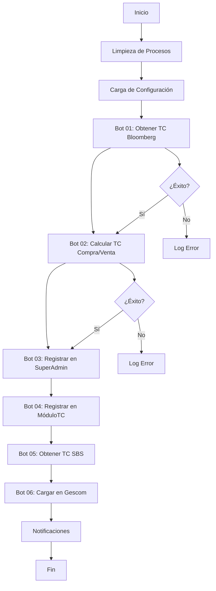

# Py Tipo Cambio - Sistema de Automatización de Tipo de Cambio

[](https://www.python.org/downloads/)
[](https://www.docker.com/)
[](LICENSE)

Sistema automatizado para la obtención, cálculo y registro de tipos de cambio USD/PEN desde múltiples fuentes financieras, con integración completa a sistemas administrativos empresariales.

## 📋 Tabla de Contenidos

- [Descripción](#-descripción)
- [Características](#-características)
- [Arquitectura](#️-arquitectura)
- [Instalación](#-instalación)
- [Configuración](#️-configuración)
- [Uso](#-uso)
- [Flujo de Trabajo](#-flujo-de-trabajo)
- [Desarrollo](#-desarrollo)
- [Testing](#-testing)
- [Docker](#-docker)
- [Logging y Monitoreo](#-logging-y-monitoreo)
- [Notificaciones](#-notificaciones)
- [Troubleshooting](#-troubleshooting)
- [Contribución](#-contribución)
- [Licencia](#-licencia)

## 📋 Descripción

Py Tipo Cambio es un sistema robusto y automatizado que gestiona el proceso completo de obtención y registro de tipos de cambio USD/PEN desde diversas fuentes financieras autorizadas. El sistema está diseñado para operaciones empresariales que requieren precisión, confiabilidad y trazabilidad completa en el manejo de tipos de cambio.

### Fuentes de Datos Soportadas

- **Bloomberg** - Fuente principal y autorizada
- **SBS (Superintendencia de Banca y Seguros)** - Fuente oficial peruana
- **BCRP (Banco Central de Reserva del Perú)** - Fuente gubernamental
- **Exchange Rate API** - API comercial
- **XE.com** - Servicio de cambio internacional
- **Investing.com** - Portal financiero
- **Google Finance** - Servicio de Google

### Sistemas Integrados

- **SuperAdmin** - Sistema administrativo principal
- **MóduloTC** - Módulo especializado en tipos de cambio
- **Gescom** - Sistema de gestión comercial

## 🚀 Características

### ✅ Funcionalidades Principales
- **Automatización completa** del proceso de tipo de cambio
- **Múltiples fuentes** de datos financieros con fallback automático
- **Cálculo automático** de márgenes de compra/venta configurables
- **Integración nativa** con sistemas administrativos empresariales
- **Notificaciones en tiempo real** vía webhook (Google Chat)
- **Logging detallado** con trazabilidad completa
- **Manejo robusto de errores** con reintentos automáticos
- **Configuración flexible** mediante archivos INI
- **Soporte Docker** para despliegue containerizado
- **Monitoreo de recursos** del sistema

### ✅ Características Técnicas
- **Arquitectura modular** con separación clara de responsabilidades
- **Web scraping avanzado** con Selenium y anti-detección
- **Cliente HTTP robusto** con manejo de timeouts y reintentos
- **Exportación de datos** en múltiples formatos (Excel, PDF)
- **Planificación de tareas** con ejecución programada
- **Limpieza automática** de procesos y recursos
- **Validación de datos** con reglas de negocio configurables

## 🏗️ Arquitectura

El sistema está organizado en una arquitectura modular que separa claramente las responsabilidades:

```
py_tipo_cambio/
├── main.py                          # Orquestador principal
├── variables_globales.py            # Variables globales del sistema
├── modulos/                         # Módulos especializados
│   ├── bot_00_configuracion.py     # Configuración del sistema
│   ├── bot_01_tc_bloomberg.py      # Obtención TC desde Bloomberg
│   ├── bot_02_calcular_tc.py       # Cálculo de TC compra/venta
│   ├── bot_03_super_admin.py       # Registro en SuperAdmin
│   ├── bot_04_modulo_tc.py         # Registro en MóduloTC
│   ├── bot_05_tc_sbs.py            # Obtención TC desde SBS
│   └── bot_06_gescom_cargar_tc.py  # Carga en Gescom
├── utilidades/                      # Utilidades del sistema
│   ├── httpclient.py               # Cliente HTTP avanzado
│   ├── logger.py                   # Sistema de logging
│   ├── notificaciones_mail.py      # Notificaciones por email
│   ├── notificaiones_whook.py      # Notificaciones webhook
│   ├── planificador.py             # Planificación de tareas
│   ├── selenium.py                 # Utilidades Selenium
│   ├── exportador.py               # Exportación de datos
│   ├── limpieza.py                 # Limpieza de procesos
│   ├── conexionApi.py              # Conexiones API
│   └── excepciones.py              # Manejo de excepciones
├── config/                         # Configuración
│   ├── config.ini                  # Configuración principal
│   └── config.py                   # Cargador de configuración
├── cliente/                        # Directorios de entrada/salida
│   ├── input/                      # Archivos de entrada
│   └── output/                     # Archivos generados
├── test/                           # Tests del sistema
├── logs/                           # Logs del sistema
└── dockerfile                      # Configuración Docker
```

## 📦 Instalación

### Requisitos Previos

- **Python 3.8+** (recomendado 3.11)
- **Chrome/Firefox** (para web scraping)
- **Acceso a APIs** de Bloomberg (configurable)
- **Docker** (opcional, para despliegue containerizado)

### Instalación Local

1. **Clonar el repositorio:**
```bash
git clone <repository-url>
cd py_tipo_cambio
```

2. **Crear entorno virtual (recomendado):**
```bash
python -m venv venv
source venv/bin/activate  # En Windows: venv\Scripts\activate
```

3. **Instalar dependencias:**
```bash
pip install -r requirements.txt
```

4. **Configurar el sistema:**
```bash
cp config/config.ini.example config/config.ini
# Editar config/config.ini con tus credenciales
```

5. **Crear directorios necesarios:**
```bash
mkdir -p logs cliente/input cliente/output
```

### Instalación con Docker

1. **Construir la imagen:**
```bash
docker build -t py-tipo-cambio .
```

2. **Ejecutar el contenedor:**
```bash
docker run -v $(pwd)/config:/app/config \
           -v $(pwd)/logs:/app/logs \
           -v $(pwd)/cliente:/app/cliente \
           py-tipo-cambio
```

3. **Con Docker Compose (recomendado):**
```bash
# Crear docker-compose.yml
version: '3.8'
services:
  py-tipo-cambio:
    build: .
    volumes:
      - ./config:/app/config
      - ./logs:/app/logs
      - ./cliente:/app/cliente
    environment:
      - PYTHONUNBUFFERED=1
    restart: unless-stopped

# Ejecutar
docker-compose up -d
```

## ⚙️ Configuración

### Archivo de Configuración (`config/config.ini`)

```ini
[general]
nombre_bot = tipo_cambio
version = 1.0
debug = false

[valores]
brecha = 3.0          # Margen aplicado al tipo de cambio (%)
inicial = 3.0         # Valor inicial para cálculos
final = 5.0           # Valor final para cálculos
timeout = 30          # Timeout para requests (segundos)

[api]
api_modulo_login = "https://modulotc.ligo.live/api/auth"
api_modulo_tc_add = "https://modulotc.ligo.live/api/exchange_rate_date/add"
api_superadmin = "https://superadmin.example.com/api"
api_gescom = "https://gescom.example.com/api"

[webhooks]
webhook_url = "https://chat.googleapis.com/v1/spaces/..."
webhook_exception = "https://chat.googleapis.com/v1/spaces/..."

[bloomberg]
url = "https://www.bloomberg.com/markets/currencies"
selector = ".priceText__1853e8a5"
timeout = 60

[sbs]
url = "https://www.sbs.gob.pe/app/pp/SISTIP_PORTAL/Paginas/Publicacion/TipoCambioPromedio.aspx"
selector = "#ctl00_cphContent_rgTipoCambio_ctl00__0_lblSell"

[logging]
level = INFO
format = "%(asctime)s - %(name)s - %(levelname)s - %(message)s"
file_rotation = 7     # Días de retención de logs
```

### Variables de Entorno

```bash
# Configuración básica
PYTHONUNBUFFERED=1
DISPLAY=:99

# Configuración de Chrome (Docker)
CHROME_BIN=/usr/bin/google-chrome-stable
CHROME_PATH=/usr/bin/google-chrome-stable

# Configuración de logging
LOG_LEVEL=INFO
LOG_FILE=logs/app.log
```

## 🎯 Uso

### Ejecución Básica

```bash
# Ejecutar directamente
python main.py

# Con logging detallado
python main.py --verbose

# Ejecutar módulo específico
python -c "from modulos.bot_01_tc_bloomberg import bot_run; import config.config as cfg; bot_run(cfg.load_config())"
```

### Ejecución con Docker

```bash
# Ejecutar el contenedor
docker-compose up

# Ver logs en tiempo real
docker-compose logs -f py-tipo-cambio

# Ejecutar en modo interactivo
docker run -it --rm py-tipo-cambio /bin/bash
```

### Ejemplo de Uso del Cliente HTTP

```python
from utilidades.httpclient import get_http_client
from utilidades.logger import setup_logger

# Configurar logger
logger = setup_logger("test_client")

# Obtener cliente HTTP
http_client = get_http_client()

# Realizar petición
response = http_client.make_request(
    url="https://api.example.com/data",
    method="GET",
    timeout=30
)

if response and response.status_code == 200:
    logger.info(f"Éxito: {response.status_code}")
    data = response.json()
    print(f"Datos obtenidos: {data}")
else:
    logger.error("Error en la petición")
```

### Ejemplo de Configuración de Notificaciones

```python
from utilidades.notificaiones_whook import WebhookNotifier

# Configurar notificador
notifier = WebhookNotifier("https://chat.googleapis.com/v1/spaces/...")

# Enviar notificación
notifier.send_notification(
    "✅ Proceso completado exitosamente\n"
    f"📊 TC Bloomberg: {tipo_cambio_bloomberg}\n"
    f"💰 TC Compra: {tipo_cambio_compra}\n"
    f"💸 TC Venta: {tipo_cambio_venta}"
)
```

## 📊 Flujo de Trabajo

El sistema sigue un flujo secuencial y robusto:



### Detalle de Cada Paso

1. **Configuración** - Carga y valida configuración del sistema
2. **Obtención Bloomberg** - Scraping del tipo de cambio desde Bloomberg
3. **Cálculo TC** - Aplicación de márgenes para compra/venta
4. **Registro SuperAdmin** - Registro en sistema administrativo principal
5. **Registro MóduloTC** - Registro en módulo especializado
6. **Obtención SBS** - Obtención de tipo de cambio oficial
7. **Carga Gescom** - Integración con sistema comercial
8. **Notificaciones** - Envío de notificaciones vía webhook

## 🔧 Desarrollo

### Estructura de Módulos

Cada módulo sigue un patrón estándar:

```python
import logging
from utilidades.logger import setup_logger

logger = setup_logger(__name__)

def bot_run(config):
    """
    Función principal del módulo
    
    Args:
        config (dict): Configuración del sistema
        
    Returns:
        tuple: (success: bool, message: str)
    """
    try:
        logger.info("Iniciando ejecución del módulo...")
        
        # Lógica específica del módulo
        resultado = procesar_datos(config)
        
        if resultado:
            logger.info("Módulo completado exitosamente")
            return True, "Operación exitosa"
        else:
            logger.error("Error en el procesamiento")
            return False, "Error en el procesamiento"
            
    except Exception as e:
        logger.error(f"Excepción en módulo: {str(e)}")
        return False, f"Error: {str(e)}"
```

### Agregar Nuevas Fuentes de TC

1. **Crear nuevo módulo** en `modulos/`:
```python
# modulos/bot_07_nueva_fuente.py
def bot_run(config):
    # Implementar lógica de scraping
    pass
```

2. **Agregar configuración** en `config/config.ini`:
```ini
[nueva_fuente]
url = "https://nueva-fuente.com"
selector = ".tipo-cambio"
timeout = 30
```

3. **Integrar en el orquestador** `main.py`:
```python
from modulos.bot_07_nueva_fuente import bot_run as Bot_07_NuevaFuente

# Agregar a la lista de bots
("Bot 07 - Nueva Fuente", Bot_07_NuevaFuente),
```

### Agregar Nuevos Sistemas de Destino

1. **Crear módulo de integración**:
```python
# modulos/bot_08_nuevo_sistema.py
def bot_run(config):
    # Implementar integración con nuevo sistema
    pass
```

2. **Configurar APIs** en `config/config.ini`:
```ini
[nuevo_sistema]
api_url = "https://nuevo-sistema.com/api"
api_key = "tu-api-key"
```

## 🧪 Testing

### Ejecutar Tests

```bash
# Ejecutar todos los tests
python -m pytest test/ -v

# Test específico
python test/test_bloomberg_fix.py

# Test con cobertura
python -m pytest test/ --cov=modulos --cov=utilidades

# Test de integración
python -m pytest test/test_integration.py
```

### Estructura de Tests

```
test/
├── test_bloomberg_fix.py      # Tests de Bloomberg
├── test_bot_01.py             # Tests del bot principal
├── test_integration.py        # Tests de integración
└── conftest.py                # Configuración de pytest
```

### Ejemplo de Test

```python
import pytest
from modulos.bot_01_tc_bloomberg import bot_run
from unittest.mock import patch

def test_bloomberg_success():
    """Test de obtención exitosa desde Bloomberg"""
    with patch('selenium.webdriver.Chrome') as mock_driver:
        mock_driver.return_value.find_element.return_value.text = "3.85"
        
        config = {"bloomberg": {"url": "test", "selector": "test"}}
        success, message = bot_run(config)
        
        assert success == True
        assert "3.85" in message
```

## 🐳 Docker

### Construir Imagen

```bash
# Construir imagen optimizada
docker build -t py-tipo-cambio:latest .

# Construir con cache
docker build --build-arg BUILDKIT_INLINE_CACHE=1 -t py-tipo-cambio:latest .
```

### Ejecutar Contenedor

```bash
# Ejecutar con volúmenes
docker run -d \
  --name py-tipo-cambio \
  -v $(pwd)/config:/app/config \
  -v $(pwd)/logs:/app/logs \
  -v $(pwd)/cliente:/app/cliente \
  -e PYTHONUNBUFFERED=1 \
  py-tipo-cambio:latest

# Ejecutar con variables de entorno
docker run -d \
  --name py-tipo-cambio \
  -e WEBHOOK_URL="https://chat.googleapis.com/v1/spaces/..." \
  -e LOG_LEVEL=DEBUG \
  py-tipo-cambio:latest
```

### Docker Compose

```yaml
version: '3.8'
services:
  py-tipo-cambio:
    build: .
    container_name: py-tipo-cambio
    volumes:
      - ./config:/app/config:ro
      - ./logs:/app/logs
      - ./cliente:/app/cliente
    environment:
      - PYTHONUNBUFFERED=1
      - LOG_LEVEL=INFO
    restart: unless-stopped
    healthcheck:
      test: ["CMD", "python", "-c", "import sys; sys.exit(0)"]
      interval: 30s
      timeout: 10s
      retries: 3
```

## 📝 Logging y Monitoreo

### Configuración de Logging

```python
from utilidades.logger import setup_logger

# Configurar logger
logger = setup_logger(
    name="mi_modulo",
    level="INFO",
    log_file="logs/mi_modulo.log"
)

# Uso del logger
logger.info("Iniciando proceso...")
logger.warning("Advertencia detectada")
logger.error("Error en el proceso")
logger.debug("Información de debug")
```

### Formato de Logs

```
2025-01-22 19:45:15 - Main - Orquestador - INFO - ==================== INICIO DE ORQUESTACIÓN ====================
2025-01-22 19:45:15 - Main - Orquestador - INFO - Inicio de orquestación - 2025-01-22 19:45:15
2025-01-22 19:45:15 - Main - Orquestador - INFO - Información del sistema: {'platform': 'Linux-5.4.0-x86_64', 'python_version': '3.11.0'}
2025-01-22 19:45:16 - Bot_01 - Bloomberg - INFO - Iniciando obtención de tipo de cambio desde Bloomberg
2025-01-22 19:45:18 - Bot_01 - Bloomberg - INFO - Tipo de cambio obtenido: 3.85
```

### Rotación de Logs

Los logs se rotan automáticamente:
- **Retención**: 7 días por defecto
- **Compresión**: Automática
- **Formato**: `log_YYYYMMDD_HHMMSS.log`

## 🔔 Notificaciones

### Configuración de Webhooks

```python
from utilidades.notificaiones_whook import WebhookNotifier

# Configurar notificador
notifier = WebhookNotifier(
    webhook_url="https://chat.googleapis.com/v1/spaces/...",
    timeout=30
)

# Enviar notificación simple
notifier.send_notification("✅ Proceso completado")

# Enviar notificación con formato
notifier.send_notification("""
🚀 **Proceso de Tipo de Cambio Completado**

📊 **Datos Obtenidos:**
• TC Bloomberg: 3.85
• TC Compra: 3.72
• TC Venta: 3.98
• Margen: 3.0%

⏱️ **Tiempo de Ejecución:** 2m 15s
""")
```

### Notificaciones por Email

```python
from utilidades.notificaciones_mail import EmailNotifier

# Configurar notificador de email
email_notifier = EmailNotifier(
    smtp_server="smtp.gmail.com",
    smtp_port=587,
    username="tu-email@gmail.com",
    password="tu-password"
)

# Enviar email
email_notifier.send_email(
    to="admin@empresa.com",
    subject="Reporte de Tipo de Cambio",
    body="Detalles del proceso...",
    attachments=["reporte.pdf"]
)
```

## 🔧 Troubleshooting

### Problemas Comunes

#### 1. Error de Selenium/Chrome
```bash
# Verificar instalación de Chrome
google-chrome-stable --version

# Reinstalar webdriver
pip install --upgrade webdriver-manager

# Ejecutar con display virtual
xvfb-run python main.py
```

#### 2. Error de Conexión API
```bash
# Verificar conectividad
curl -I https://api.example.com

# Verificar configuración
python -c "import config.config as cfg; print(cfg.load_config())"
```

#### 3. Error de Permisos
```bash
# Dar permisos a directorios
chmod -R 755 logs/
chmod -R 755 cliente/

# Verificar usuario Docker
docker run --user $(id -u):$(id -g) py-tipo-cambio
```

### Logs de Debug

```bash
# Ejecutar con debug
LOG_LEVEL=DEBUG python main.py

# Ver logs en tiempo real
tail -f logs/app.log

# Buscar errores específicos
grep -i "error" logs/app.log
```

### Monitoreo de Recursos

```python
import psutil

# Información del sistema
print(f"CPU Usage: {psutil.cpu_percent()}%")
print(f"Memory Usage: {psutil.virtual_memory().percent}%")
print(f"Disk Usage: {psutil.disk_usage('/').percent}%")
```

## 🤝 Contribución

### Guías de Contribución

1. **Fork el proyecto**
2. **Crear rama feature** (`git checkout -b feature/AmazingFeature`)
3. **Commit cambios** (`git commit -m 'Add AmazingFeature'`)
4. **Push a la rama** (`git push origin feature/AmazingFeature`)
5. **Abrir Pull Request**

### Estándares de Código

- **PEP 8** para estilo de código Python
- **Docstrings** para todas las funciones
- **Type hints** para parámetros y retornos
- **Tests** para nuevas funcionalidades
- **Logging** apropiado

### Estructura de Commits

```
feat: agregar nueva fuente de tipo de cambio
fix: corregir error en cálculo de márgenes
docs: actualizar documentación de API
test: agregar tests para módulo Bloomberg
refactor: optimizar cliente HTTP
```

## 📄 Licencia

Este proyecto está bajo la Licencia MIT. Ver el archivo `LICENSE` para más detalles.

## 📞 Soporte

- **Issues**: [GitHub Issues](https://github.com/tu-usuario/py_tipo_cambio/issues)
- **Documentación**: [Wiki del proyecto](https://github.com/tu-usuario/py_tipo_cambio/wiki)
- **Email**: soporte@empresa.com

---

**Desarrollado con ❤️ para automatizar procesos financieros empresariales**
